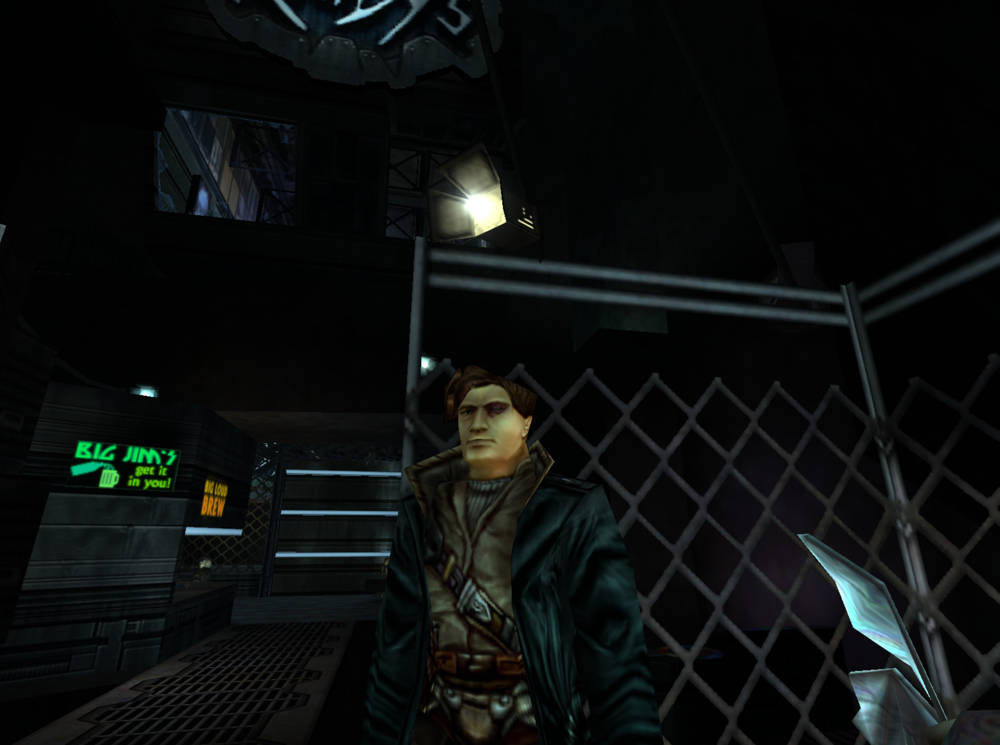
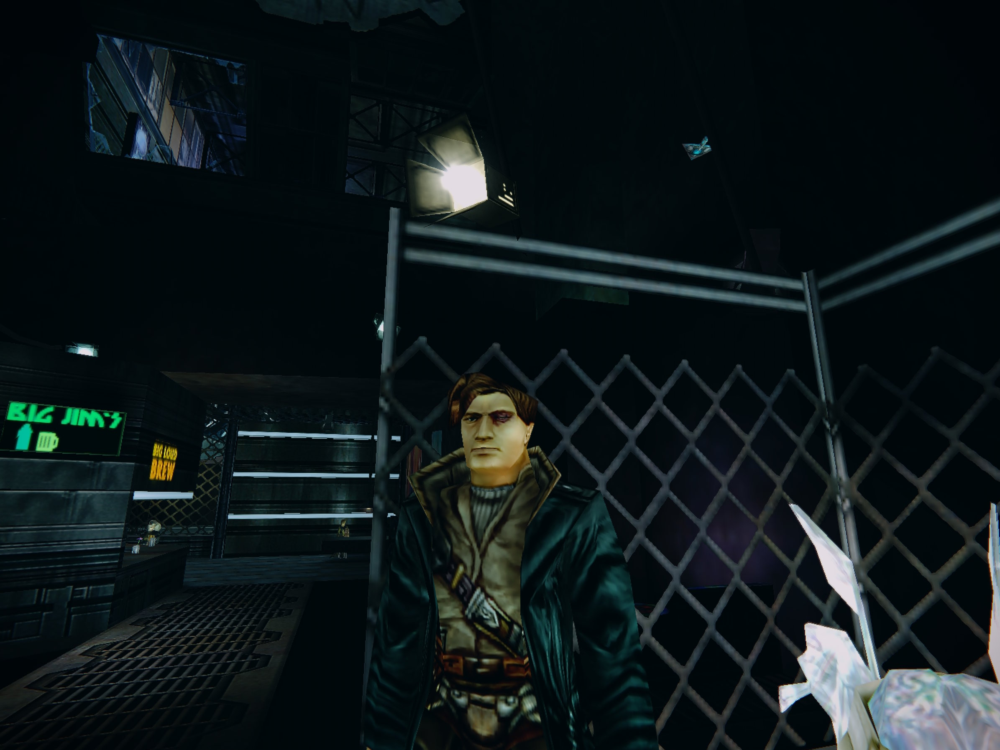

# OpenGL32 Enhancer — ReShade-style post-processing for OpenGL games

[](https://github.com/ASDAlexander77/opengl32_enhancer/actions/workflows/build.yml)

**Add FSR 1 upscaling, SMAA/TAA anti-aliasing, CAS sharpening, noise
reduction, local contrast, bloom, ACES tone mapping and LUT color grading to
old OpenGL games — by dropping one DLL into the game folder. No source code,
no patching, no launcher.**

It is a drop-in `opengl32.dll` proxy: the DLL exports every function the real
`opengl32.dll` does and forwards each call to the system OpenGL library, while
hooking `wglSwapBuffers` to run a configurable chain of GPU post-process
effects on each frame just before it is presented. Same idea as ReShade or
ENB, built specifically for 32-bit OpenGL titles.

| Before — original game output | After — bloom, tone mapping, grading and sharpening |
| --- | --- |
|  |  |

## Contents

- [Quick start](#quick-start)
- [Requirements](#requirements)
- [Effects](#effects)
  - [The "FX" badge](#the-fx-badge)
  - [Ordering](#ordering)
  - [Choosing an anti-aliasing stage: TAA vs SMAA](#choosing-an-anti-aliasing-stage-taa-vs-smaa)
  - [Choosing a sharpener: sharpen vs FSR vs CAS](#choosing-a-sharpener-sharpen-vs-fsr-vs-cas)
  - [Noise reduction: nr](#noise-reduction-nr)
  - [Local contrast: localcontrast](#local-contrast-localcontrast)
  - [Example configurations](#example-configurations)
- [Texture effects](#texture-effects)
- [Anisotropic filtering](#anisotropic-filtering)
- [How it works](#how-it-works)
- [Troubleshooting](#troubleshooting)
- [Building from source](#building-from-source)
- [Running the tests](#running-the-tests)
- [Credits](#credits)
- [License](#license)

## Quick start

1. Download `opengl32.dll`, `opengl32_enhancer.ini` and `cyberpunk.cube` from
   the [latest build artifact](../../actions), or
   [build them yourself](#building-from-source).
2. Copy all three files into the game's folder — the same directory as the
   game's `.exe`. **Not** `system32`.
3. Open `opengl32_enhancer.ini` and edit the `effect=` line to pick the stages
   you want.
4. Launch the game normally.

Windows loads the `opengl32.dll` sitting next to the game's executable in
preference to the system one, so no installer or injector is involved. To
uninstall, delete the three files.

## Requirements

| | |
| --- | --- |
| **OS** | Windows |
| **Game** | 32-bit, rendering through OpenGL (`opengl32.dll`) |
| **GPU** | Anything supporting OpenGL 4.3 compute shaders |

Direct3D and Vulkan games are not affected — this proxy only sees OpenGL
calls. If the GPU or driver cannot provide GL 4.3 compute, the affected stage
prints a message and disables itself; the game keeps running unmodified.

## Effects

The pipeline is a comma-separated list of stages on the `effect=` line in
`opengl32_enhancer.ini`, run left to right in the order written. A stage runs
only if it is named there; omit it (or set `effect=none`) to turn it off.

| Stage | What it does |
| --- | --- |
| `bilinear` | Bilinear rescale (honors `scale`) |
| `nvscaler` | NVIDIA Image Scaling upscaler (honors `scale`) |
| `fsr` | AMD FidelityFX Super Resolution 1 — EASU reconstruction + RCAS sharpening (honors `scale`) |
| `bloom` | Glow on bright highlights |
| `acestonemap` | ACES filmic tone-mapping curve |
| `lutgrading` | 3D-LUT color grading from a `.cube` file |
| `vignette` | Darkens the corners |
| `chromaticaberration` | Lens-style edge fringing |
| `taa` | Temporal anti-aliasing |
| `smaa` | Spatial anti-aliasing (SMAA) |
| `cas` | AMD FidelityFX Contrast Adaptive Sharpening (sharpen-only) |
| `sharpen` | NVIDIA Image Scaling adaptive sharpen |
| `nr` | Edge-aware (bilateral) noise reduction |
| `localcontrast` | Local tone/structure boost ("clarity"/"texture") |
| `ssao` | Screen-space ambient occlusion — contact shadows in creases and corners |
| `depthvignette` | Darkens by scene depth rather than screen corners (experimental) |
| `gamma` | Gamma / brightness correction — a real curve, so black stays black |
| `dither` | Ordered dither, masks 8-bit banding |
| `invert` | Debug/demo — inverts the image |

Every stage has its own parameters (thresholds, intensity, strength, radius
and so on), each documented inline in `opengl32_enhancer.ini` next to the
value it controls.

A `cyberpunk.cube` LUT — teal-tinted shadows, magenta/pink highlights, boosted
contrast and saturation — ships as the default `lutgrading` look.

### The "FX" badge

Whenever `effect=` lists at least one stage, a small "FX" badge is drawn in
the frame's top-right corner — a quick way to tell "the pipeline ran but the
result looks the same" apart from "the pipeline never ran at all" (wrong ini
path next to the game's `.exe`, the DLL wasn't picked up, or the GPU/driver
can't do GL 4.3 compute), without needing to check the console log. It's on by
default; once you've confirmed things are working, turn it off with
`fxIndicator=0`.

### Ordering

Order matters, and the `effect=` line is the order. Two rules cover most
cases:

- **Tone mapping and grading before the lens stages.** Put `acestonemap` and
  `lutgrading` ahead of `vignette` and `chromaticaberration`, so the LUT
  grades real scene colors rather than colors the lens simulation has already
  darkened.
- **Anti-aliasing before sharpening.** Sharpening after AA recovers detail the
  AA softened; sharpening before it just resharpens edges the AA then
  re-smooths.
- **Noise reduction before sharpening AND before local contrast.** Put `nr`
  early in the chain: sharpening noisy source just resharpens the noise `nr`
  is about to remove, and boosting local contrast (`localcontrast`) on
  still-noisy source makes the noise more visible, not less.

`dither` belongs last, so it dithers the finished image immediately before it
reaches the 8-bit back buffer.

`gamma` is an output correction, so it wants the same end of the chain — after
grading, immediately before `dither`. Putting it early instead is a legitimate
thing to try, using `brightness` as an exposure control feeding `acestonemap`.

### Choosing an anti-aliasing stage: TAA vs SMAA

Both anti-alias, but they fail in opposite situations. Pick based on which
failure mode matters more in a given game, and **don't list both** — they
solve the same problem, so stacking them is wasted GPU time, not better
anti-aliasing.

| | `taa` | `smaa` |
| --- | --- | --- |
| Method | Blends current frame with history | Single-frame edge detection + morphological reconstruction |
| Strength | Very effective on static or slow-moving scenes | No motion artifacts at all; consistent during camera movement |
| Weakness | Can ghost or fail to smooth during fast motion | Purely spatial, so generally blurrier on fine static detail |

`taa` has no access to the game's motion vectors — a `wglSwapBuffers` proxy
has no way to obtain them — which is precisely why it can struggle exactly
when anti-aliasing matters most. It does automatically cut a pixel's history
weight the larger that pixel's raw frame-to-frame difference is, so a fast
scene change (a cut, a snap-turn) converges in about one frame rather than
visibly trailing for several — but ordinary fast *motion* within a still-
continuous scene has no such sharp signal to key off, and remains where `taa`
is weakest.

### Choosing a sharpener: sharpen vs FSR vs CAS

Three stages sharpen. Stacking them just double-sharpens, so pick one:

| Stage | Cost | Character |
| --- | --- | --- |
| `sharpen` | Heaviest | NVIDIA Image Scaling's NVSharpen — a full USM-style filter with its own coefficient tables and a large neighborhood |
| `fsr` | Medium | RCAS is limiter-driven: it refuses to sharpen anywhere doing so would clip. Very safe, but it declines to touch already-saturated edges at all |
| `cas` | Lightest | One 3x3 neighborhood and a simple cross filter. Sharpens more uniformly across the image than RCAS, and costs less than NVSharpen |

Note that `fsr` both reconstructs and sharpens, so listing it alongside
`sharpen` or `cas` double-sharpens too.

### Noise reduction: `nr`

An edge-aware (bilateral) spatial denoiser — it treats nearby pixels with a
similar brightness as "the same surface" and smooths between them, while
mostly leaving real edges alone. Useful on grainy/noisy rendering (software
dithering, low-precision shading, upscaled or emulator output) that a plain
blur would just as happily smear across genuine detail.

| Parameter | What it does |
| --- | --- |
| `nrIntensity` | How large a brightness difference still counts as "the same surface". Low = subtle, high = aggressive |
| `nrPasses` | How many times the filter runs in sequence (1–4) — compounds the smoothing independently of `nrIntensity` |
| `nrColorStrength` | How much of the filtered *color* to keep. Most real denoisers hit color harder than brightness by default, since color noise reads as far uglier at the same magnitude |
| `nrTonePreservation` | Protects *brightness/detail* specifically — 1.0 leaves luma untouched regardless of the other settings, denoising color only |
| `nrGrainPreservation` | Re-adds back some of the real detail the filter removed, so NR can smooth without flattening a deliberately grainy look |

### Ambient occlusion: `ssao`

Darkens creases, corners and the places where objects meet, by estimating how much of each
pixel's surrounding hemisphere is blocked by nearby geometry. id Tech 2-era renderers bake all
their lighting into lightmaps and have no ambient occlusion term whatsoever, so this is the
stage that makes objects look *seated* in the world instead of pasted onto it.

It is the only stage that needs more than the finished frame: it reads the game's depth buffer,
and it reads the game's projection by intercepting the `glFrustum` call the engine makes when it
sets up the 3D view. (Reading the projection matrix at swap time would not work — these engines
draw the HUD last under an orthographic projection, so by then the world's projection is gone.)
If either is unavailable — no depth buffer on the context, or the game builds its projection some
other way and never calls `glFrustum` — the stage no-ops instead of guessing, and the rest of the
pipeline is unaffected. On first successful capture it logs `projection: captured first frustum`,
which is the quickest way to confirm it is actually running.

| Parameter | What it does |
| --- | --- |
| `ssaoRadius` | How far from a pixel geometry still counts as occluding it, **in the game's own world units** — not a 0..1 fraction like nearly every other value here. Quake II units are roughly an inch, so useful values are in the tens. This is the one setting that genuinely needs tuning per game |
| `ssaoIntensity` | How dark fully-occluded pixels get. `0` is an exact no-op |
| `ssaoBias` | View-space epsilon that stops a flat surface occluding itself through depth-precision noise. Raise it if flat walls look dirty or banded; lower it if contact shadows have gone missing |

Put `ssao` **early** in the chain, ahead of `acestonemap` and `lutgrading`: it is a lighting
term, so it belongs on scene colors that are then graded, not painted over a finished grade.

Two caveats worth knowing before you tune it. Normals are reconstructed from the depth buffer
rather than read from a G-buffer the wrapper doesn't have, so they are unreliable on very thin
geometry and at silhouette edges. And 2D/HUD elements typically don't write depth, so they carry
whatever the world left behind them — meaning the HUD can pick up occlusion from geometry it is
drawn over. How visible that is depends entirely on the game's HUD.

### Local contrast: `localcontrast`

The "clarity"/"texture" pair familiar from photo editors: boosts brightness
detail by unsharp-masking against two different blur radii, so the two
controls act at genuinely different, independent spatial scales.

| Parameter | What it does |
| --- | --- |
| `localStructureStrength` | Boosts fine detail/micro-texture (small blur radius) |
| `localToneStrength` | Boosts broad midtone separation — the classic "clarity" look (large blur radius) |

Both default to a modest `0.3`; `0` for either disables that layer.

### Gamma and brightness: `gamma`

The "everything is too dark on my monitor" control. Per pixel, in this order:

```
c = max(color.rgb * brightness, 0)
c = pow(c, vec3(1 / gamma))
```

`brightness` is applied first, and as a **gain** rather than an offset. That is
what makes this a real gamma curve instead of an additive lift: black is `0`,
`0 * anything` is still `0`, so the floor stays put at every setting. An
additive brightness control raises black off the floor, and the image goes grey
and washed out long before it looks brighter.

| Parameter | What it does |
| --- | --- |
| `gamma` | Display exponent, `0.5`–`3.0`. `1.0` is an exact no-op, above `1.0` brightens the midtones, below `1.0` darkens them. `2.2` is the classic correction. The low end stops at `0.5` because the shader divides by this value |
| `brightness` | Linear gain applied before the exponent, `0.0`–`2.0`. `1.0` is a no-op |

Both default to `1.0`, so listing `gamma` in `effect=` and leaving the values
alone costs one dispatch and changes nothing.

Note that this acts on the **composited frame**, unlike a game's own
brightness/gamma cvars, which typically rebuild palettes or relight lightmaps —
so it reaches content those never touch, and the two stack if you use both.

### Example configurations

**Sharper image, minimal stylization** — a good first thing to try:

```ini
effect=smaa, cas, dither
sharpness=0.6
ditherStrength=0.7
```

**Upscale from a lower internal resolution with FSR 1:**

```ini
effect=fsr, dither
scale=0.75
sharpness=0.75
fsrDenoise=1
```

**Clean up noisy/grainy source, then add some punch:**

```ini
effect=nr, localcontrast, dither
nrIntensity=0.6
nrPasses=2
nrColorStrength=1.0
nrTonePreservation=0.2
localStructureStrength=0.4
localToneStrength=0.4
ditherStrength=0.7
```

**Full cinematic look** — reconstruction, glow, tone mapping, grading and lens
simulation:

```ini
effect=bilinear, fsr, bloom, acestonemap, lutgrading, vignette, chromaticaberration, taa, dither
scale=1.0
bloomThreshold=0.8
bloomIntensity=0.5
acesStrength=0.8
lutPath=cyberpunk.cube
lutStrength=0.3
vignetteIntensity=0.25
vignetteRadius=0.7
chromaticAberrationStrength=0.3
taaBlend=0.85
sharpness=0.75
ditherStrength=0.7
```

**Everything off** (useful when checking whether the proxy itself is the cause
of a problem):

```ini
effect=none
textureEffect=none
```

## Texture effects

Separately from the `effect=` pipeline — which only ever touches the final
composited frame — the `textureEffect=` setting runs the game's *own textures*
through a single stage as they are uploaded, in place.

Only small, uncompressed `GL_RGBA`/`GL_UNSIGNED_BYTE` uploads are handled
(there is no S3TC/BC decoding), and dimensions are never changed — only pixel
content is.

| Value | Behavior |
| --- | --- |
| `none` | No texture-level processing. **Default.** |
| `sharpen` | The same NVIDIA Image Scaling adaptive-sharpen pass as the `sharpen` stage, at the `sharpness` value |
| `cas` | The `cas` stage's Contrast Adaptive Sharpening, also at `sharpness`. Lighter than `sharpen`, which matters here because this runs on every eligible texture at load time |
| `invert` | Debug/demo — handy for spotting which draws use which textures |

All of them pass the source alpha channel through untouched. That matters far
more here than in the `effect=` pipeline: the back buffer is opaque, but a
game's textures use alpha as a cutout/blend mask. A stage writing a constant
alpha would turn every alpha-masked sprite, font glyph and decal into an
opaque rectangle — on screen, it looks like the texture has gained a
solid-color background. Alpha is deliberately not sharpened either, since that
would harden cutout edges the game blends on purpose.

`fsr`, `nr` and `localcontrast` are all deliberately rejected here — every one
of them is multi-pass with its own owned intermediate texture(s) sized to the
upload, so all three would reallocate on nearly every texture at many
different sizes (`fsr`'s EASU pass is also a near no-op at identical
dimensions anyway). Use `cas` for texture-level sharpening; `nr` and
`localcontrast` are whole-frame/whole-scene effects, not really about a single
asset's own texel data in the first place.

Older config files may still say `textureSharpen=1`/`0`; it is read as an
alias for `textureEffect=sharpen`/`none`.

## Anisotropic filtering

`anisotropy` (0..16, default 8 in the shipped ini) fixes the classic id Tech
2-era "blurry floor a few feet ahead" look. Anisotropic filtering didn't
widely exist when these renderers were written, so their world/model textures
only ever request `GL_LINEAR_MIPMAP_NEAREST` ("bilinear mip," not true
trilinear) and never anisotropic filtering at all.

This is a separate mechanism from `effect=`/`textureEffect=` — it intercepts
`glTexParameter*` calls rather than the composited frame or a texture upload.
Whenever the **game itself** sets a mipmap-capable `GL_TEXTURE_MIN_FILTER` on
a 2D texture, that's the engine's own per-texture signal "this one uses
mip-mapping" — it gets upgraded to full trilinear plus the configured level of
anisotropic filtering (capped to whatever the GPU/driver actually supports).
2D/UI/HUD/font elements are conventionally uploaded with a *non*-mipmap min
filter specifically so they stay pixel-exact, and those are left completely
untouched — texture size and upload order aren't reliable ways to tell the
two apart, but this signal is.

`0` disables the feature entirely (every `glTexParameter*` call forwarded
exactly as the game made it). There's essentially no reason to use less than
the hardware maximum (usually 16): the visual cost of *not* using anisotropic
filtering is far more noticeable than its performance cost on anything made
in the last decade-plus.

## Tuning settings: the config editor

Getting `effect=` and its parameters right by editing the ini, relaunching the game, loading a
save and walking to somewhere representative is a slow loop. `config_editor.exe` collapses it:
it renders a scene, runs **the real `ApplySelectedEffect()` pipeline** over it — the same code
the DLL runs in-game, not a preview that approximates it — and puts an ImGui panel beside the
result. Stages can be toggled, reordered and retuned live, then saved back to the ini.

It is a separate application rather than an in-game overlay on purpose. An overlay would mean
subclassing the game's window procedure from inside its process and fighting it for mouse and
keyboard input — a lot of risk, in someone else's address space, to move a slider. The editor
owns its own window, message loop and GL context, so none of that applies.

```sh
cmake --build --preset x86-release --target config_editor
build-x86-release/config_editor_dir/config_editor.exe [path/to/opengl32_enhancer.ini]
```

With no argument it edits the copy of the ini sitting next to it; pass a path (the game's own
ini, say) to edit that instead. **Save writes values in place** — the surrounding comments,
which are the actual reference for what every setting does, are preserved rather than
regenerated away.

### Tuning against a real game frame

The editor's built-in scene is a synthetic room built at Quake II's scale, which is enough for
most settings. But the ones that are hardest to get right are exactly the ones it cannot model
honestly: `ssaoRadius` is denominated in the game's own world units, and `bloomThreshold`
depends on the actual brightness distribution of the game's art.

So the DLL can hand the editor a real frame. In-game, press `frameDumpKey` (F11 by default) to
write the current frame — color, depth and the captured projection — next to the game's `.exe`.
Load that file in the editor and every stage, `ssao` included, runs against genuine game content
with genuine depth. The dump is taken before any stage runs, so it works with `effect=none` too
and always yields unprocessed source.

## How it works

1. Windows resolves `opengl32.dll` next to the game's `.exe` before the copy
   in `system32`, so the game loads this proxy instead of the real library.
   (`opengl32.dll` is not on the KnownDLLs list, which is what makes this
   possible.)
2. The proxy locates the genuine system OpenGL library via
   `GetSystemDirectoryA` and forwards every exported call to it, so the game
   behaves exactly as before.
3. `wglSwapBuffers` is intercepted. Before the real one is called, the
   finished frame is captured into a texture and run through the configured
   chain of GL 4.3 compute shaders, then blitted back.
4. `glTexImage2D` is intercepted separately for the optional
   [texture effects](#texture-effects), and `glTexParameteri`/`glTexParameterf`
   for [anisotropic filtering](#anisotropic-filtering).

Exports are emitted under their true undecorated names through a `.def` file,
since `__declspec(dllexport)` alone would apply `__stdcall`'s `@N` decoration
on x86 and no longer match what a host application imports by name.

## Troubleshooting

**Nothing happens — the game looks unchanged.** Check that `effect=` is not
commented out (a leading `;` comments a line) and does not read `none`. Check
too that the game really is OpenGL; many games ship both a Direct3D and an
OpenGL renderer and default to Direct3D.

**The game will not start, or exits immediately.** The most likely cause is a
bitness mismatch: this is a 32-bit DLL, and a 64-bit game cannot load it.

**Strange artifacts, or the screen is black.** Check whether another
`opengl32.dll` wrapper is already installed in the game folder. Software
renderers and debug wrappers — Mesa/Gallium, GLIntercept, ANGLE, WARP — also
install themselves as `opengl32.dll`, and only one can win. A clean game
install with only this DLL added is the fastest way to rule that out.

**Quake II-engine games (including Anachronox) ignore the DLL.** These load
their renderer through the `gl_driver` cvar rather than linking `opengl32.dll`
directly. Set `gl_driver` to the proxy, or leave it at its default of
`opengl32` and make sure the proxy is the `opengl32.dll` in the game folder.

**Effects are disabled with a message about GL 4.3.** The GPU or driver does
not expose the compute-shader support the effects need. This is expected on
very old hardware, and on software renderers.

## Building from source

Windows and MSVC only, targeting x86 (32-bit) — `wglSwapBuffers` interception
targets 32-bit OpenGL games, which is what nearly all of them are.

```sh
cmake --preset x86-release
cmake --build --preset x86-release --target opengl32_enh32
```

The resulting `build-x86-release/opengl32_enh32.dll` is what gets renamed to
`opengl32.dll` for installation.

`.github/workflows/build.yml` performs a from-scratch build with no local
Visual Studio assumptions, and produces the same three-file install archive as
a CI artifact.

## Running the tests

Most stages have a GPU-backed test (`*_test.cpp`) that creates a real GL
context and drives the effect's compute pipeline directly. `post_effects_test`
is an integration test: it runs the actual `opengl32_enhancer.ini` from this
repository end to end and writes before/after `.ppm` images for a human to
judge.

Every test target is registered with CTest, so the whole suite runs with:

```sh
cmake --build --preset x86-release
cd build-x86-release && ctest --output-on-failure
```

Prefer `ctest` over globbing `*_test.exe` in the build directory. A glob also
picks up stale executables left behind by targets that have since been
removed — which makes a deleted test look like a failing one — and it runs
each test from whatever the current directory happens to be, whereas CTest
runs each from its own build directory, where the fixtures it expects (the
copied `opengl32_enhancer.ini` and `cyberpunk.cube`) actually live.

The tests create their own windows and run unattended, but they do need a real
GPU and driver: they cannot pass on a machine without working GL 4.3 compute
support.

## Credits

Several stages are hand-ported to GLSL 430 compute shaders from public
reference implementations:

- **FSR 1** (`fsr`) and **CAS** (`cas`) — from AMD's
  [FidelityFX](https://github.com/GPUOpen-Effects/FidelityFX-CAS) reference
  (`ffx_fsr1.h`, `ffx_cas.h`).
- **NVScaler / NVSharpen** (`nvscaler`, `sharpen`) — from
  [NVIDIA Image Scaling](https://github.com/NVIDIAGameWorks/NVIDIAImageScaling).
- **SMAA** (`smaa`) — from the
  [reference SMAA implementation](https://github.com/iryoku/smaa).

[Dear ImGui](https://github.com/ocornut/imgui) (v1.91.5, MIT) is vendored under
`third_party/imgui` and used only by `config_editor.exe` — the shipped `opengl32.dll` does not
link it.

Each ported source file carries the original copyright and license notice in
its header, along with notes on every deliberate deviation from the reference.

## License

[MIT](LICENSE). The third-party ports listed above are MIT licensed too, so
they are compatible; their original notices are reproduced in the
[LICENSE](LICENSE) file and must be retained in any redistribution.
